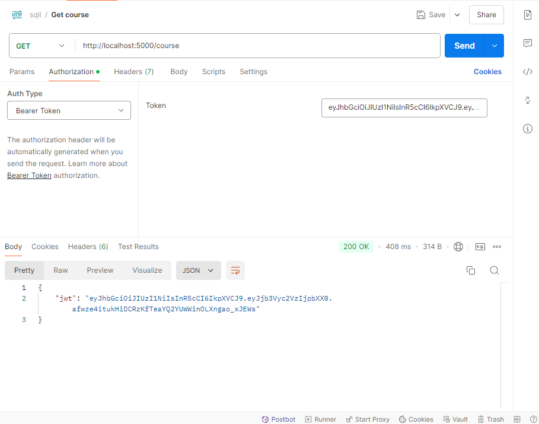

<!--toc:start-->
# Table of Contents

- [How to Contribute?](#how-to-contribute)
- [Please Read Before Submitting Changes!](#please-read-before-submitting-changes)
- [Making and Submitting Changes](#making-and-submitting-changes)
  - [Fork this repository](#fork-this-repository)
  - [Clone this repository](#clone-this-repository)
  - [Create a branch](#create-a-branch)
  - [Make changes and commit](#make-changes-and-commit)
  - [Push changes to GitHub](#push-changes-to-github)
  - [Submit your changes for review](#submit-your-changes-for-review)
- [Contributing to Frontend](#contributing-to-frontend)
    - [Obtaining a Tiptap Pro token](#obtaining-a-tiptap-pro-token)
    - [Questions?](#questions-1)
  - [Submitting changes to frontend](#submitting-changes-to-frontend)
- [Contributing to Backend](#contributing-to-backend)
    - [JWT Authentication](#jwt-authentication)
    - [Questions?](#questions-2)
  - [Submitting changes to backend](#submitting-changes-to-backend)
- [Reporting Bugs](#reporting-bugs)
- [Resolving Bugs](#resolving-bugs)
<!--toc:end-->

# How to Contribute?
Thanks for you interest in being a part of our mission!
Please review [Making and Submitting Changes](#making-and-submitting-changes) to learn how to properly contribute to Sqil's frontend, backend, or resolving bugs. Or, simply report a bug!<br />

Also, [join our Slack](https://join.slack.com/t/sqilworkspace/shared_invite/zt-2ptm4ft9u-ecqBBSNMolnZGQWbCL8NbA) to contact us! This is the easiest way to communicate with us.

**Ways to contribute:**
- [Frontend](#contributing-to-frontend)
- [Backend](#contributing-to-backend)
- [Reporting Bugs](#reporting-bugs)
- [Resolving Bugs](#resolving-bugs)
# Please Read Before Submitting Changes!
While you may start up the frontend individually while developing, to test this application as a whole, you MUST install Docker Desktop. Additionally, backend development requires Docker since this is how the database and code compiler is run. [Follow these instructions to install](https://docs.docker.com/desktop/). <br /> <br />
Make sure that you have tested the website to ensure that it works as intended before submitting any changes. You can build the website with Docker by running:
```bash
cd sqil
docker compose -f compose-dev.yaml build
docker compose -f compose-dev.yaml up
```
Go to http://localhost:3000 and test your changes! If it works as intended, you are ready to [submit your changes](#push-changes-to-github).

# Making and Submitting Changes
## Fork this repository
Click the fork button on the top of the page to create a copy of this repository in your account. <br />


## Clone this repository
Open a terminal and run the following git command:
```bash
git clone https://github.com/username/sqil.git
```
Ensure that `username` is the username of the account you just forked this repository from.

## Create a branch
Change repository directory:
```bash
cd sqil
```
Create a branch to make changes:
```bash
git switch -c your-new-branch-name
```
Ensure that `your-new-branch-name` is relevant to your contribution. <br />


## Make changes and commit
```bash
git commit -m "Add sqil contribution"
```
Ensure that your commit meets the [Commit Message Guidelines](https://gist.github.com/robertpainsi/b632364184e70900af4ab688decf6f53).

## Push changes to GitHub
```bash
git push -u origin your-new-branch-name
```
Ensure that `your-new-branch-name` matches the branch you created earlier.

## Submit your changes for review
Click `Compare & pull request`. <br /> <br />


Now, follow the guidelines for [Submitting changes to frontend](#contributing-to-frontend), [Submitting changes to backend](#contributing-to-backend), or [Resolving Bugs](#resolving-bugs), depending on your contribution.

# Contributing to Frontend
The frontend is written in Typescript and TSX, utilizing [Next.js](https://nextjs.org/), [Mantine](https://mantine.dev/) for styling and components, and [Tiptap](https://tiptap.dev/) for lesson editing. To start up the frontend, you must have Docker installed and running, and have a Tiptap Pro token (instructions for this are [here](#obtaining-a-tiptap-pro-token)). Review [Please Read Before Submitting Changes!](#please-read-before-submitting-changes) if you have not already done so. When writing code, ensure that there are no type errors.

The frontend can be started with the following commands:
```bash
cd sqil
docker compose -f compose-dev.yaml build app
docker compose -f compose-dev.yaml up app
```

Once the container is running, you should be able to access the frontend at http://localhost:3000.

### Obtaining a Tiptap Pro token
1. Make an account at https://cloud.tiptap.dev/login.
2. Find your Tiptap Pro token at https://cloud.tiptap.dev/login.
3. Add your token as an environment variable by adding `TIPTAP_PRO_TOKEN=<token>` (replace `<token>` with your token) to `sqil/.env`

### Questions?
Don't forget that we have a [Slack](https://join.slack.com/t/sqilworkspace/shared_invite/zt-2ptm4ft9u-ecqBBSNMolnZGQWbCL8NbA)! If you have trouble testing the frontend, please reach out to `@Krit Dass` for help.

## Submitting changes to frontend

### Bug Fixing Route
If this is how you are contributing, make sure you have replied to the **issue** you are fixing, even if you raised this issue. Check out [Resolving Bugs](#resolving-bugs) for instructions.

### Adding Issue for New Pages (Or New Features to Pages)
If this is how you are contributing, please open an **issue** prior to your Pull Request:
- Apply the "enhancement" and "frontend" tag and any other fitting labels.
- Write a clear and descriptive title.
- List the pages you will add or modify.
- Explain what will be modified for each page.

### Pull Request for Frontend Features
When submitting a **pull request** for a new page or component, please give us a thorough description of your contribution:
- Write a clear and descriptive title for the feature added.
- List the pages or components you added or modified.
- Explain what's new about each page or component modified.

You are now ready to submit your **pull request**. We will review it as soon as possible! Thanks for your contribution.

# Contributing to Backend
The backend api is written in Python, using the Flask framework and SQLAlchemy for PostgreSQL queries.
To start up the backend, you must have Docker installed and running. Review [Please Read Before Submitting Changes!](#please-read-before-submitting-changes) if you have not already done so.

The backend can be started with the following commands:
```bash
cd sqil
docker compose -f compose-dev.yaml build api
docker compose -f compose-dev.yaml up api
```
Once the container is running, you should be able to send api requests to any route with the base URL http://localhost:5000.

It is strongly recommended that you download the [Postman app](https://www.postman.com/downloads/) for testing api routes.

### JWT Authentication
Most routes are protected by JWT tokens. These tokens are stored in a cookie on the browser when the user logs in or registers.

Therefore, when testing you must register a new user or login with an existing user to obtain a JWT token to  use other routes. You can do this in Postman like so:


We never send raw data. You must go to https://jwt.io/ to decode the jwt token data. Paste the response you get from Postman, and you should see the JWT authentication token upon logging in or registering.


You may now copy and use this token while testing routes for as long as this container is running. For example, if I am testing the /course api route to see the list of programming courses, I must first go the **Authorization** tab in postman, select **Bearer Token** for **Auth Type**, and paste the JWT authentication token here.



After clicking the **Send** button, the response should proceed and not raise a "Missing Authorization Header" message.

### Questions?
Don't forget that we have a [Slack](https://join.slack.com/t/sqilworkspace/shared_invite/zt-2ptm4ft9u-ecqBBSNMolnZGQWbCL8NbA)! If you have trouble testing the backend, please reach out to `@Krish Kapoor` for help.

## Submitting changes to backend

### Bug Fixing Route
If this is how you are contributing, make sure you have replied to the **issue** you are fixing, even if you raised this issue. Check out [Resolving Bugs](#resolving-bugs) for instructions.

### Adding Issue for  New Routes (Or New Features to Routes)
If this is how you are contributing, please open an **issue** prior to your Pull Request:
- Apply the "enhancement" and "backend" tag and any other fitting labels.
- Write a clear and descriptive title.
- List the api routes you will add or modify.
- Explain what each api route will do.

### Pull Request for Backend Features
When submitting a **pull request** for a new route or feature, please give us a thorough description of your contribution:
- Write a clear and descriptive title for the route or feature added.
- List the api routes you added or modified.
- Explain what each api route does after the changes.

You are now ready to submit your **pull request**. We will review it as soon as possible! Thanks for your contribution.

# Reporting Bugs 

- Apply the "bug", "backend" or "frontend," and any other fitting labels.
- Write a clear and descriptive title for the issue.
- State whether you are resolving the issue or simply reporting it.
  - If you are resolving the issue yourself, assign yourself to "Assignees"
- Describe the steps which produce the problem.
- Describe the incorrect behavior.
- Explain the expected behavior.

Click **Submit new issue**!

# Resolving Bugs
- Reply to the issue you are working on fixing. Do not work on an issue someone is already working on.
- Follow the instructions for [Making and Submitting Changes](#making-and-submitting-changes) and either [Contributing to Frontend](#contributing-to-frontend) or [Contributing to Backend](#contributing-to-backend), depending on the issue.

## Pull Request for Bug Fixes
- Title your Pull Request "Fix: `issue`", where `issue` is the exact title of the issue you are resolving.
### Frontend
- List the pages you modified.
- Explain how each page/component modification resolves the issue.
### Backend
- List the api routes you modified.
- Explain how each api route resolves the issue.

We will review your changes as soon as possible!
