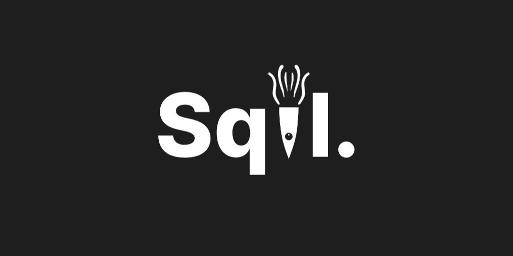

# Our Mission

We aim to make computer science accessible and free to anyone by helping instructors design courses with ease.

# Contributing

We welcome and highly encourage contributions as it allows us to see *your* unique insight. Before contributing, please review [CONTRIBUTING.md](.github/CONTRIBUTING.md).

# License

Sqil is licensed under the [GNU General Public License](https://www.gnu.org/licenses/#GPL). See [COPYING](COPYING.txt) for more information.
