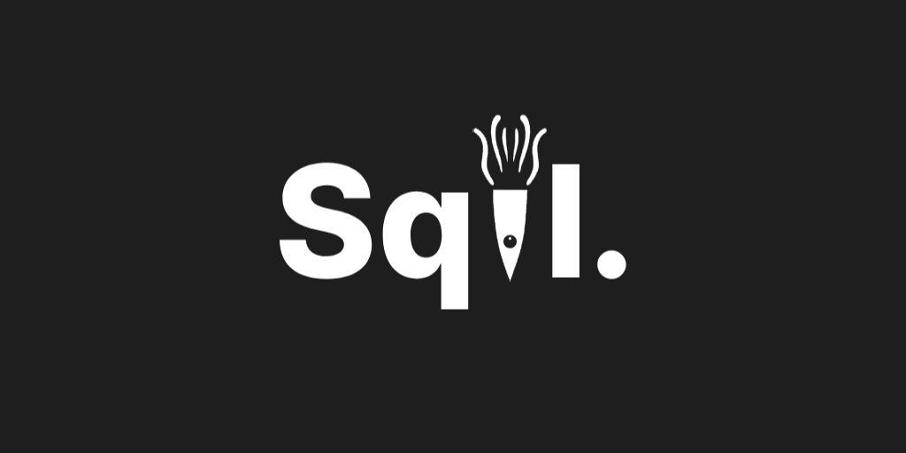

<a href="https://sqil.org/">
    

        
    

</a>

**A new framework for course design.**

# Our Mission

We aim to make computer science accessible to everyone by helping instructors design courses with ease.

# Contributing

We welcome and highly encourage contributions as it allows us to see *your* unique insight. Before contributing, please review [CONTRIBUTING.md](.github/CONTRIBUTING.md).

# License

Sqil is licensed under the [GNU General Public License](https://www.gnu.org/licenses/#GPL). See [COPYING](COPYING.txt) for more information.
